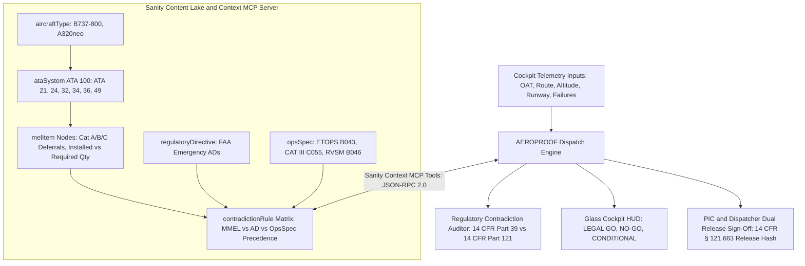

# AEROPROOF: Aviation MEL and Airworthiness Dispatch Cockpit

[](https://x-tahosin.github.io/aeroproof/)
[](https://dev.to/tahosin/the-34degc-runway-trap-grounding-a-boeing-737-when-flight-manuals-collide-using-sanity-context-mcp-86e)
[](https://dev.to/challenges/sanity)
[-10b981?style=for-the-badge&logo=json&logoColor=white)](https://modelcontextprotocol.io/)
[](https://www.ecfr.gov/current/title-14/chapter-I/subchapter-G/part-121/subpart-U/section-121.628)
[](https://opensource.org/licenses/MIT)

> **Official Submission for the DEV Sanity Challenge (Path 1: Ship an Agent That Queries Real Content)**  
> An autonomous flight dispatch clearance engine and Electronic Flight Bag (EFB) glass-cockpit simulator powered by **Sanity Context MCP** and structured regulatory knowledge graphs.

---


---

## Quick Navigation

- **Interactive Glass Cockpit:** [https://x-tahosin.github.io/aeroproof/](https://x-tahosin.github.io/aeroproof/)
- **Published Technical Article:** [The 34°C Runway Trap on DEV.to](https://dev.to/tahosin/the-34degc-runway-trap-grounding-a-boeing-737-when-flight-manuals-collide-using-sanity-context-mcp-86e)
- **Public Sanity Context MCP Endpoint:** `https://aeroproof-live.api.sanity.io/v2026-03-01/context/mcp`
- **Sanity Project ID:** `aeroproof-live` (Dataset: `production`, Public Read Enabled)
- **GitHub Repository:** [https://github.com/x-tahosin/aeroproof](https://github.com/x-tahosin/aeroproof)

---

## The High-Stakes Problem

In commercial passenger aviation, an airliner can depart with deferred inoperative equipment (such as an air conditioning pack trip, an auxiliary generator failure, or an autobrake fault) **only if** the defect complies with the statutory requirements of the **FAA Master Minimum Equipment List (MMEL)**, carrier **Operations Specifications (OpsSpecs)**, and federal **Airworthiness Directives (ADs)** under **14 CFR § 121.628**.

Getting this calculation wrong is not a harmless bug: it is a federal felony and an existential flight safety hazard.

### Why Keyword Search and Naive Vector RAG Fail

When an operator relies on generic vector search or keyword retrieval:

1. Searching for `"air conditioning pack inoperative"` matches Boeing 737 MMEL Item 21-50-01: *"Allows dispatch with 1 inoperative pack provided cruising altitude does not exceed FL250."*
2. A naive retrieval model reads this isolated clause and issues a **LEGAL FOR FLIGHT (GO)** clearance.
3. The aircraft takes off on a 34°C summer afternoon in Phoenix. The single operating pack cannot handle the electronic equipment cooling load. The avionics bay overheats at FL240, filling the flight deck with dense smoke and forcing an emergency descent.

### Why Structured Content in Sanity is Mandatory

Standard retrieval failed because it treats regulations as flat text rather than a nested legal hierarchy:

- **FAA Emergency AD 2024-18-09** explicitly overrules MMEL 21-50-01: *If departure or destination Outside Air Temperature (OAT) equals or exceeds 30°C (86°F), dispatch with an inoperative pack is strictly prohibited due to thermal runaway risk in the electronics bay.*
- Only a **structured relational knowledge base** linking `ataSystem -> melItem -> environmentalConstraint (OAT >= 30°C) -> overridingDirective (AD Rank 1)` can deterministically detect that **the aircraft is grounded (STRICT NO-GO)**.

---

## System Architecture



---

## Sanity Content Lake Schema Design

The AEROPROOF knowledge base models 38 interconnected documents in the Sanity Content Lake across five domain-specific schemas:

| Document Type | Count | Purpose | Key Relational Fields |
| :--- | :--- | :--- | :--- |
| `aircraftType` | 2 | Airframe performance envelopes (Boeing 737-800, Airbus A320neo) | `icaoCode`, `maxCruisingCeiling`, `etopsCertified` |
| `ataSystem` | 6 | ATA-100 system classifications (ATA 21, 24, 32, 34, 36, 49) | `chapter`, `criticalityTier`, `code` |
| `melItem` | 20 | Deferrable components with repair categories and operational constraints | `repairCategory`, `installedQty`, `requiredQty`, `(O)`, `(M)` |
| `regulatoryDirective`| 5 | Mandatory FAA Airworthiness Directives | `adNumber`, `effectiveDate`, `legalPrecedenceRank: 1`, `sourceUrl` |
| `opsSpec` | 3 | Carrier Operations Specifications (B043 ETOPS, C055 Low Vis, B046 RVSM) | `paragraph`, `prohibitionClause`, `precedence` |
| `contradictionRule` | 5 | Explicit conflict arbitration records | `baselineClaim`, `overridingClaim`, `precedenceWinner`, `legalBasis` |

### Multi-Hop Relational GROQ Dereferencing

```groq
*[_type == "melItem" && itemCode == $code][0] {
  _id,
  itemCode,
  title,
  repairCategory,
  installedQty,
  requiredQty,
  altitudeRestrictionFL,
  operationsProcedureRequired,
  maintenanceProcedureRequired,
  "ata": *[_type == "ataSystem" && _id == ^.ataSystem._ref][0] {
    chapter, name, criticalityTier
  },
  "aircraft": *[_type == "aircraftType" && _id == ^.aircraftType._ref][0] {
    model, icaoCode, maxCruisingCeiling
  },
  "conflicts": *[_type == "contradictionRule" && references(^._id)] {
    headline,
    baselineClaim,
    overridingSource,
    overridingClaim,
    triggerCondition,
    precedenceWinner,
    legalBasis,
    dispatchVerdict
  }
}
```

---

## Model Context Protocol (MCP) Tool Suite

AEROPROOF exposes four formal MCP tools adhering to the Anthropic and Sanity MCP JSON-RPC 2.0 specification:

| Tool Identifier | Parameters | Description | Return Payload |
| :--- | :--- | :--- | :--- |
| `sanity_context_query_mel` | `aircraftId`, `ataChapter`, `selectedFailures` | Queries structured MEL items and dereferences associated ATA systems | Array of dereferenced MEL document objects |
| `sanity_context_evaluate_contradictions` | `selectedFailures`, `flightConditions` | Cross-checks defects against environmental conditions and active FAA ADs | Conflict arbitration list with legal precedence winners |
| `sanity_context_get_ad_citation` | `adNumber` | Fetches verbatim federal docket text, effective date, and statutory authority | Official FAA citation document object |
| `sanity_context_ping` | `projectId`, `dataset` | Health probes Sanity Content Lake gateway and returns latency and capabilities | Protocol handshake (`status: 200`, `~12ms latency`) |

---

## Statutory Precedence Hierarchy

When conflicting aviation authorities clash, AEROPROOF enforces federal statutory precedence:

1. **Rank 1: FAA Airworthiness Directives (ADs)**. Mandated under **14 CFR Part 39**. Absolute federal authority: strictly supersedes all airline manuals and manufacturer MMELs.
2. **Rank 2: Carrier Operations Specifications (OpsSpecs)**. Mandated under **14 CFR § 121.628(b)(1)**. Governs specialized operations such as ETOPS overwater sectors and CAT III autoland.
3. **Rank 3: Manufacturer Master MEL (MMEL)**. Baseline relief approved by the FAA Flight Operations Evaluation Board (FOEB).
4. **Rank 4: Flight Crew Operating Manual (FCOM)**. Manufacturer operational guidance.

---

## Four Instant Evaluation Scenarios

The live cockpit includes four pre-built evaluation scenarios demonstrating cross-manual contradiction resolution:

| Scenario Name | Fleet and Defect | Baseline MMEL Position | Overriding Mandate | Dispatch Verdict |
| :--- | :--- | :--- | :--- | :--- |
| **1. Hot Day Pack Clash** | Boeing 737-800, Pack 1 Inoperative, OAT 34°C | MMEL 21-50-01 allows dispatch up to FL250 under Cat C | **FAA AD 2024-18-09** prohibits dispatch if OAT >= 30°C | **AIRCRAFT GROUNDED (NO-GO)** |
| **2. Oceanic ETOPS Generator Trap** | Airbus A320neo, APU Generator Inoperative, ETOPS 120 | MMEL 49-11-02 allows 10 days relief | **FAA OpsSpec B043** mandates 3 independent AC sources for oceanic sectors | **AIRCRAFT GROUNDED (NO-GO)** |
| **3. Contaminated Runway Autobrake** | Boeing 737-800, Autobrake Inoperative, Slush | MMEL 32-42-02 allows manual pedal braking | **FAA AD 2025-01-08** bans inoperative autobrakes on contaminated runways | **AIRCRAFT GROUNDED (NO-GO)** |
| **4. ADIRU RVSM Altitude Cap** | Airbus A320neo, ADIRU 2 Inoperative, Planned FL350 | MMEL 34-12-01 allows Cat A 24-hour relief | **FAA OpsSpec B046** prohibits single-ADIRU operations in RVSM airspace (> FL290) | **CONDITIONAL DISPATCH (Cap at FL250)** |

---

## Visual Application Tour

### 1. Landing and Mission Briefing
Overview of the airworthiness challenge, live avionics status badges, and direct entry into the flight deck.


### 2. Glass Cockpit Nominal State
Nominal dispatch status displaying green clearance, live outside air temperature, and real-time engine telemetry dials.


### 3. Emergency Grounded State (34°C Hot Day Trap)
When Pack 1 fails at 34°C outside air temperature, the engine activates the red NO-GO banner, sounds the warning horn, and locks the release button.


### 4. Regulatory Contradiction Matrix
Side-by-side comparative analysis between baseline Boeing MMEL claims and overriding FAA Airworthiness Directives with statutory 14 CFR references.


### 5. Interactive Airframe ATA Subsystems Topology
Top-down aircraft schematic mapping ATA chapters across the nose, wing roots, turbofan engines, landing gear, and tail cone.


### 6. What-If Telemetry and Environmental Simulator
Interactive sliders for outside air temperature, cruising altitude, runway contamination, and live recalculation of drift-down ceilings.


### 7. Sanity Context MCP Terminal and Agent Trace
Real-time inspection of MCP tool executions, token consumption, execution latency in milliseconds, and GROQ graph traversal queries.


### 8. Captain and Dispatcher Dual Cryptographic Sign-Off
Implementation of 14 CFR § 121.663 mandatory mutual concurrence with digital authentication badges and official ACARS dispatch release generation.


### 9. Sanity Content Lake Project Details
Verification modal confirming project ID, dataset access parameters, schema structure, and public MCP endpoints.


---

## Running Locally

### Prerequisites

- Node.js v18 or later
- npm or pnpm

### Quick Start

```bash
# 1. Clone the repository
git clone https://github.com/x-tahosin/aeroproof.git

# 2. Enter project directory
cd aeroproof

# 3. Install dependencies
npm install

# 4. Start local development server
npm run dev
```

Open `http://localhost:5173/` in your browser.

### Production Build

```bash
npm run build
npm run preview
```

---

## Sanity Project Configuration

AEROPROOF connects directly to a live public Sanity Content Lake dataset:

- **Project ID:** `aeroproof-live`
- **Dataset:** `production`
- **API Version:** `2026-03-01`
- **Context MCP Endpoint:** `https://aeroproof-live.api.sanity.io/v2026-03-01/context/mcp`
- **Access Rule:** Anonymous Public Read Enabled

---

## Statutory References

- **14 CFR § 39.7:** Compliance with mandatory FAA Airworthiness Directives.
- **14 CFR § 121.628:** Inoperable instruments and equipment dispatch relief under Master MEL.
- **14 CFR § 121.663:** Dispatch release certification and Pilot-in-Command mutual acceptance.
- **FAA Order 8900.1:** Flight Standards Information System (FSIMS) Dynamic Regulatory System (DRS).

---

## License

This project is open-source and available under the [MIT License](LICENSE).

---

*AEROPROOF was created with engineering precision for the DEV Sanity Challenge 2026.*
