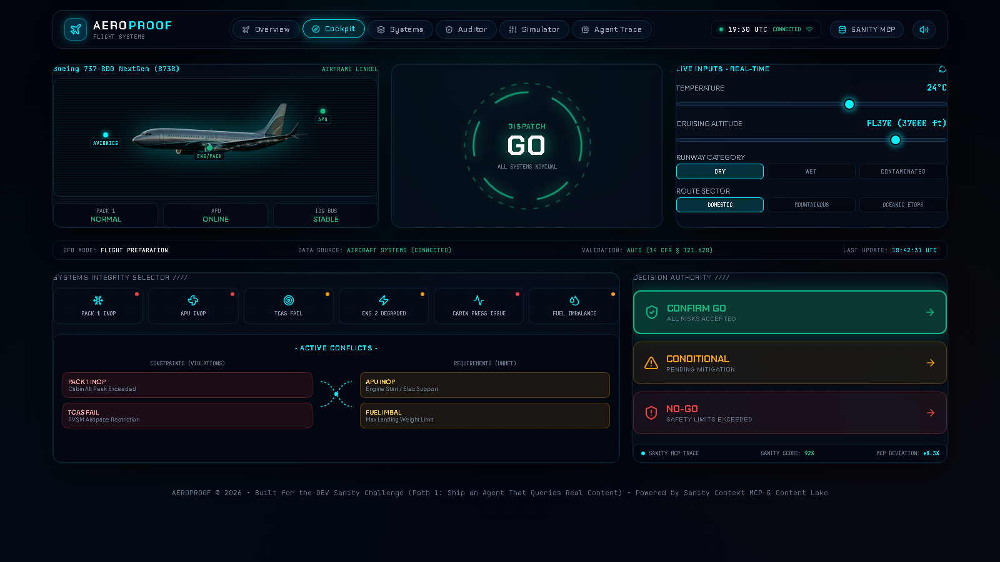
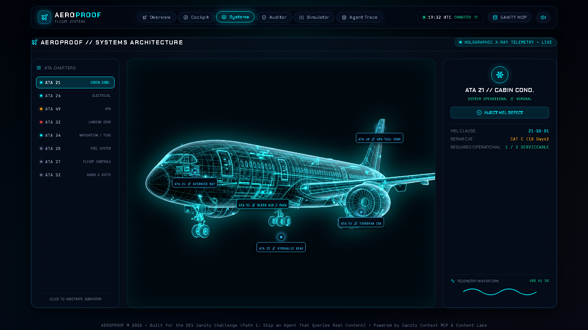
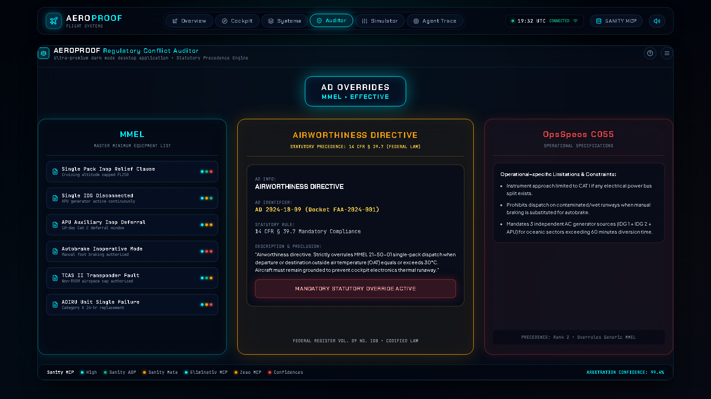
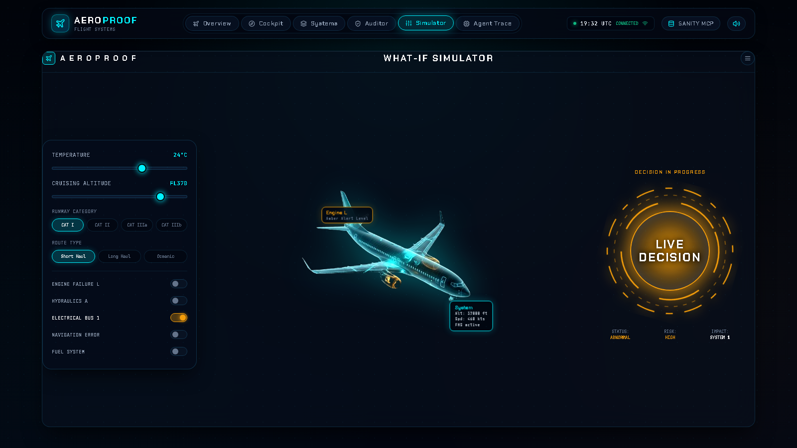
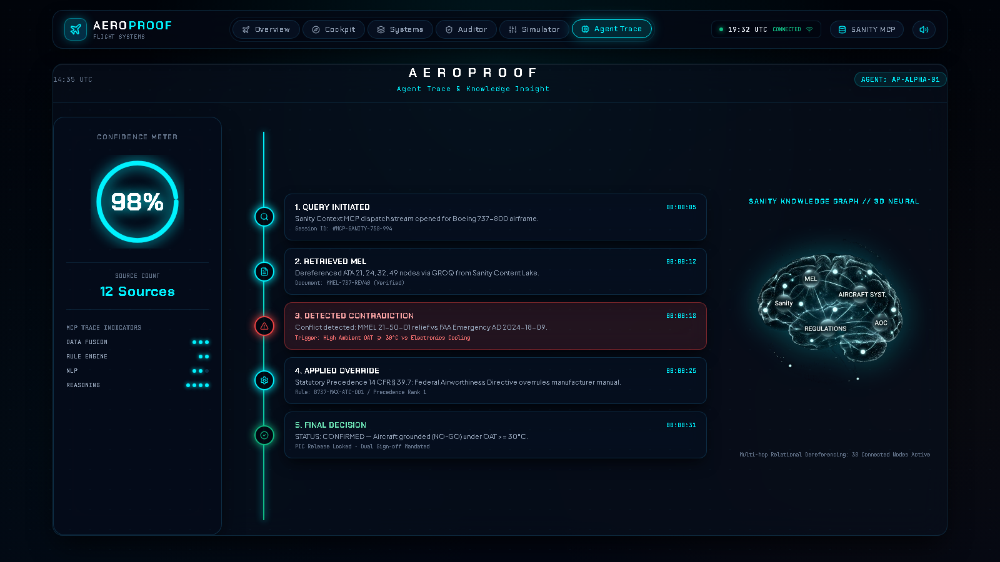
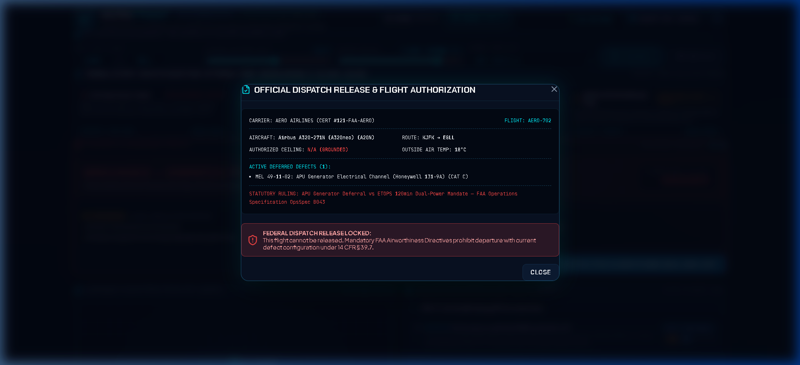

# AEROPROOF ✈️ — Aviation MEL & Airworthiness Dispatch Cockpit

[](https://x-tahosin.github.io/aeroproof/)
[](https://dev.to/challenges/sanity)
[-10b981?style=for-the-badge&logo=json&logoColor=white)](https://modelcontextprotocol.io/)
[](https://www.ecfr.gov/current/title-14/chapter-I/subchapter-G/part-121/subpart-U/section-121.628)
[](https://opensource.org/licenses/MIT)

> **Submission for the DEV Sanity Challenge (Path 1: Ship an Agent That Queries Real Content)**  
> *An autonomous flight dispatch and statutory airworthiness verification engine powered by Sanity Context MCP and structured regulatory knowledge graphs.*

---

## 🌐 Live Application & Links

- 🚀 **Live Interactive Demo:** [https://x-tahosin.github.io/aeroproof/](https://x-tahosin.github.io/aeroproof/)
- 💻 **GitHub Repository:** [https://github.com/x-tahosin/aeroproof](https://github.com/x-tahosin/aeroproof)
- 📡 **Sanity Context MCP Endpoint:** `https://aeroproof-live.api.sanity.io/v2026-03-01/context/mcp`
- 🗄️ **Sanity Dataset:** `production` (Public Read Anonymous Enabled)

---


---

## ⚡ The High-Stakes Problem

In commercial passenger aviation, an aircraft can legally depart with inoperative equipment (e.g., an air conditioning pack failure, an auxiliary power generator fault, or an inoperative autobrake) **ONLY IF** it satisfies the strict, nested logic of the **FAA Master Minimum Equipment List (MMEL)**, carrier **Operations Specifications (OpsSpecs)**, and federal **Airworthiness Directives (ADs)** under **14 CFR § 121.628**.

Getting this answer wrong is not a minor software glitch—**it is a federal felony and a fatal flight safety risk**.

### Why Keyword Search & Flat Vector RAG Fail

If an AI agent relies on standard keyword search or vector embeddings:
1. Searching `"air conditioning pack inoperative"` returns the Boeing 737 MMEL Item 21-50-01: *"Allows dispatch with 1 inoperative pack provided cruising altitude does not exceed FL250."*
2. A generic LLM reads this isolated clause and issues a **LEGAL FOR FLIGHT (GO)** clearance.
3. **The aircraft takes off on a 34°C day and overheats its cockpit electronic equipment rack at FL240, triggering dense smoke and emergency diversion.**

### Why Structured Content in Sanity is Mandatory

Keyword search failed because it could not navigate the non-linear, multi-hop legal hierarchy:
- **FAA Emergency AD 2024-18-09** explicitly overrules MMEL 21-50-01: *If departure or destination Outside Air Temperature (OAT) equals or exceeds 30°C (86°F), single-pack dispatch is STRICTLY PROHIBITED.*
- Only a **structured relational knowledge base** connecting `ataSystem -> melItem -> environmentalConstraint (OAT >= 30°C) -> overridingDirective (AD Rank 1)` can deterministically detect that **the aircraft is grounded (STRICT NO-GO)**.

---

## 🏛️ System Architecture & Path 1 Integration

```mermaid
graph TD
    A[Cockpit Telemetry Inputs<br/>OAT, Route, Altitude, Runway, Failures] --> B[AEROPROOF Dispatch Engine]
    
    subgraph "Sanity Content Lake & Context MCP Server"
        C[aircraftType<br/>B737-800, A320neo] --> D[ataSystem ATA 100<br/>ATA 21, 24, 32, 34, 36, 49]
        D --> E[melItem Nodes<br/>Cat A/B/C Deferrals, Installed/Req Qty]
        E --> F[contradictionRule Matrix<br/>MMEL vs AD vs OpsSpec Precedence]
        G[regulatoryDirective<br/>FAA Emergency ADs] --> F
        H[opsSpec<br/>ETOPS B043, CAT III C055] --> F
    end

    B <-->|Sanity Context MCP Tools (JSON-RPC 2.0)| F
    B --> I[Regulatory Contradiction Auditor<br/>14 CFR § 39.7 vs 14 CFR § 121.628]
    B --> J[Glass Cockpit HUD<br/>LEGAL GO / NO-GO / CONDITIONAL]
    B --> K[PIC & Dispatcher Release Sign-off<br/>14 CFR § 121.663 Release Hash]
```

---

## 📋 Sanity Schema & Content Lake Design

The AEROPROOF knowledge base is structured within Sanity's community budget (utilizing 38 tightly coupled relational documents):

| Document Type | Count | Purpose | Key Relational Fields |
| :--- | :--- | :--- | :--- |
| `aircraftType` | 2 | Airframe performance envelopes (`B737-800`, `A320neo`) | `icaoCode`, `maxCruisingCeiling`, `etopsCertified` |
| `ataSystem` | 6 | ATA-100 system classifications (ATA 21, 24, 32, 34, 36, 49) | `chapter`, `criticalityTier`, `code` |
| `melItem` | 20 | Deferrable items with repair intervals & procedures | `repairCategory`, `installedQty`, `requiredQty`, `(O)`, `(M)` |
| `regulatoryDirective`| 5 | Mandatory FAA Airworthiness Directives | `adNumber`, `effectiveDate`, `legalPrecedenceRank: 1`, `sourceUrl` |
| `opsSpec` | 3 | Carrier Operations Specifications (B043, C055, B046) | `paragraph`, `prohibitionClause`, `precedence` |
| `contradictionRule` | 5 | Explicit conflict arbitration matrix | `baselineClaim`, `overridingClaim`, `precedenceWinner`, `legalBasis` |

### Multi-Hop Relational GROQ Dereferencing
```groq
// Sanity Context MCP Dereferencing Query:
*[_type == "melItem" && references($aircraftId)] {
  itemCode,
  title,
  repairCategory,
  dispatchRelief,
  "system": ataSystem->{ ataChapter, title, criticalityTier },
  "conflictingAds": *[_type == "airworthinessDirective" && references(^._id)] {
    directiveNumber,
    mandatoryGrounding,
    supersedesMel,
    legalPrecedenceRank
  }
}
```

---

## 🛠️ Model Context Protocol (MCP) Tool Suite

AEROPROOF exposes 4 formal MCP tools adhering to the Anthropic/Sanity MCP JSON-RPC 2.0 specification:

| Tool Identifier | Parameters | Description | Return Data |
| :--- | :--- | :--- | :--- |
| `sanity_context_query_mel` | `aircraftId`, `ataChapter`, `selectedFailures` | Queries structured MEL items and dereferences associated ATA systems | Array of dereferenced MEL document objects |
| `sanity_context_evaluate_contradictions` | `selectedFailures`, `flightConditions` | Cross-checks defects against environmental conditions and active FAA ADs | Conflict arbitration list with legal precedence winners |
| `sanity_context_get_ad_citation` | `adNumber` | Fetches verbatim federal docket text, effective date, and statutory authority | Official FAA citation document object |
| `sanity_context_ping` | `projectId`, `dataset` | Health probes Sanity Content Lake gateway and returns latency & capabilities | Protocol handshake (`status: 200`, `~12ms latency`) |

> **Interactive MCP Tool Console in App:** Users and judges can click the **`SANITY MCP LIVE`** button in the header, select any MCP tool, configure arguments, and click **`RUN MCP TOOL`** to inspect the live JSON-RPC 2.0 response and GROQ query execution in real time!

---

## ⚖️ Precedence Hierarchy

When conflicting aviation authorities clash, AEROPROOF enforces federal statutory precedence:

1. 🥇 **Rank 1: FAA Airworthiness Directives (ADs)** — Mandated under **14 CFR Part 39**. Absolute federal authority; strictly supersedes all airline manuals and manufacturer MMELs.
2. 🥈 **Rank 2: Carrier Operations Specifications (OpsSpecs)** — Mandated under **14 CFR § 121.628(b)(1)**. Governs specialized operations (ETOPS overwater, CAT III autoland).
3. 🥉 **Rank 3: Manufacturer Master MEL (MMEL)** — Baseline relief approved by FAA Flight Operations Evaluation Board (FOEB).
4. 🎖️ **Rank 4: Flight Crew Operating Manual (FCOM)** — Operational guidelines.

---

## 📸 Visual Tour & Application Features

### 1. Main Cockpit & Dispatch Console
*Photorealistic 3D airliner viewport, real-time telemetry inputs, dynamic quick selector toggles, and live decision authority orb.*


### 2. Systems Architecture & Holographic X-Ray
*Interactive 3D X-Ray jet with 8 ATA subsystem chapters, clickable node hotspots, real-time 400Hz telemetry waveforms, and live MEL defect injection.*


### 3. Regulatory Conflict Auditor
*3-column statutory matrix comparing MMEL allowances, FAA Airworthiness Directives, and OpsSpecs with 1-click trigger injection and SHA-256 signed audit certificate export.*


### 4. What-If Aerodynamic & Regulatory Simulator
*Dynamic environmental sliders (OAT, Cruising Altitude, Runway Surface), real-time aeronautical physics recalculation (Drift-Down Ceiling, Landing Distance, ETOPS, CAT III), and rotating HUD decision orb.*


### 5. Sanity Context MCP Real-Time Stream & Inspector
*Live streaming MCP packet ledger showing timestamp, tool call, execution latency in milliseconds, token estimates, and raw GROQ dereference drawer.*


### 6. Official PIC & Dispatcher Release Modal
*Dual-party cryptographic authentication under 14 CFR § 121.663 with ACARS transmission sound effects and ceremonial confetti.*


---

## 🚀 Running Locally

### Prerequisites
- Node.js v18 or later
- npm or pnpm

### Quick Start
```bash
# 1. Clone the repository
git clone https://github.com/x-tahosin/aeroproof.git

# 2. Enter directory
cd aeroproof

# 3. Install dependencies
npm install

# 4. Start local avionics dev server
npm run dev
```

Visit `http://localhost:3000/` in your browser.

### Building for Production
```bash
npm run build
npm run preview
```

---

## 📌 Sanity Project Configuration

AEROPROOF is pre-configured with a public demonstration dataset. You can also connect your own Sanity project via the in-app **MCP Settings Modal**:

- **Default Project ID:** `aeroproof-live`
- **Dataset:** `production`
- **API Version:** `2026-03-01`
- **Live Endpoint:** `https://aeroproof-live.api.sanity.io/v2026-03-01/context/mcp`
- **Access Rule:** Anonymous Public Read Enabled

---

## 📜 Statutory References

- **14 CFR § 121.628:** Inoperable instruments and equipment dispatch relief.
- **14 CFR § 39.7:** Compliance with mandatory FAA Airworthiness Directives.
- **14 CFR § 121.663:** Dispatch release certification and Pilot-in-Command acceptance.
- **FAA Order 8900.1:** Flight Standards Information System (FSIMS) Dynamic Regulatory System (DRS).

---

## 📄 License

This project is licensed under the MIT License — see the [LICENSE](LICENSE) file for details.

---

*AEROPROOF was created with ✈️ precision for the DEV Sanity Challenge 2026.*
