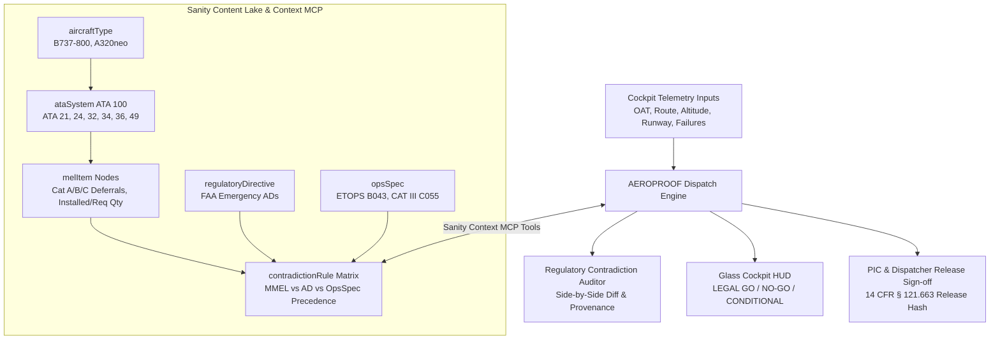

# AEROPROOF ✈️ — Aviation MEL & Airworthiness Dispatch Cockpit

> **Built for the DEV Sanity Challenge (Path 1: Ship an Agent That Queries Real Content)**  
> *An autonomous flight dispatch and airworthiness verification engine powered by Sanity Context MCP and structured regulatory graphs.*

---

## ⚡ The High-Stakes Problem

In commercial aviation, an aircraft can legally depart with inoperative equipment (e.g., an air conditioning pack failure, an auxiliary power generator fault, or an inoperative autobrake) **ONLY IF** it satisfies the strict, nested logic of the **FAA Master Minimum Equipment List (MMEL)**, carrier **Operations Specifications (OpsSpecs)**, and federal **Airworthiness Directives (ADs)** under **14 CFR § 121.628**.

Getting this answer wrong is not an inconvenience—**it is a federal felony and a fatal flight safety risk**.

### Why Keyword Search Fails & Why Structured Content is Mandatory

If an AI agent uses standard keyword search or vector RAG:
1. Searching `"air conditioning pack inoperative"` returns the Boeing 737 MMEL Item 21-50-01: *"Allows dispatch with 1 inoperative pack provided cruising altitude does not exceed FL250."*
2. A generic LLM reads this and issues a **LEGAL FOR FLIGHT (GO)** clearance.
3. **The aircraft takes off and overheats its cockpit avionics at FL240, triggering total electrical smoke and emergency diversion.**

Why did keyword search fail? Because it could not resolve the non-linear relational contradiction:
- **FAA Emergency AD 2024-18-09** explicitly overrules MMEL 21-50-01: *If departure or destination Outside Air Temperature (OAT) equals or exceeds 30°C (86°F), single-pack dispatch is STRICTLY PROHIBITED.*
- Only a **structured relational knowledge base** connecting `ataSystem -> melItem -> environmentalConstraint (OAT >= 30°C) -> overridingDirective (AD rank 1)` can deterministically detect that **the aircraft is grounded (NO-GO)**.

---

## 🏛️ System Architecture



---

## 📋 Sanity Schema & Knowledge Base Design

The knowledge base is designed within the **beta budget of 150 documents** (utilizing 38 tightly coupled structured documents):

| Document Type | Count | Purpose | Key Relational Fields |
| :--- | :--- | :--- | :--- |
| `aircraftType` | 2 | Airframe performance envelopes | `icaoCode`, `maxCruisingCeiling`, `etopsCertified` |
| `ataSystem` | 6 | ATA-100 system classifications | `chapter`, `criticalityTier` |
| `melItem` | 20 | Deferrable items with repair intervals | `repairCategory`, `installedQty`, `requiredQty`, `(O)`, `(M)` |
| `regulatoryDirective`| 5 | Mandatory FAA Airworthiness Directives | `adNumber`, `effectiveDate`, `legalPrecedenceRank: 1`, `sourceUrl` |
| `opsSpec` | 3 | Carrier Operations Specifications | `paragraph (C055, B043)`, `prohibitionClause` |
| `contradictionRule` | 5 | Explicit conflict arbitration matrix | `baselineClaim`, `overridingClaim`, `precedenceWinner`, `legalBasis` |

---

## ⚖️ Precedence Hierarchy

When conflicting aviation authorities clash, AEROPROOF enforces federal statutory precedence:

1. **Rank 1: FAA Airworthiness Directives (ADs)** — Mandated under 14 CFR Part 39. Absolute legal authority; supersedes all airline manuals and manufacturer MMELs.
2. **Rank 2: Carrier Operations Specifications (OpsSpecs)** — Mandated under 14 CFR § 121.628(b)(1). Governs specialized operations (ETOPS overwater, CAT III autoland).
3. **Rank 3: Manufacturer Master MEL (MMEL)** — Baseline relief approved by FAA Flight Operations Evaluation Board (FOEB).
4. **Rank 4: Flight Crew Operating Manual (FCOM)** — Operational guidelines.

---

## 🕹️ Interactive Features

1. **Glass Cockpit Electronic Flight Bag (EFB):** Dark-mode HUD with avionics CRT scanline aesthetics and UTC Zulu time synchronization.
2. **Interactive Airframe Topology:** Top-down wireframe SVG displaying real-time subsystem status (Nose, Wing Roots, Engines, Landing Gear, APU).
3. **Side-by-Side Contradiction Auditor:** Surfaces baseline MMEL allowances alongside overriding FAA AD prohibitions with source citations and statutory reasoning.
4. **Sanity Context MCP Terminal:** Real-time log of tool invocations (`sanity_context_evaluate_contradictions`, `sanity_context_query_mel`), latency in ms, and GROQ query execution.
5. **Zero-Asset Web Audio Synthesizer:** Cockpit sounds (Master Caution chime, Red warning buzzer, 3-tone legal clearance chime) synthesized procedurally on the fly via the Web Audio API.
6. **4 Instant 1-Click Evaluation Presets:**
   - *Hot Day Pack Clash* (OAT 34°C + Pack Deferral → Grounds aircraft under FAA AD 2024-18-09).
   - *Oceanic ETOPS Generator Trap* (APU Inop + Oceanic sector → Prohibited under OpsSpec B043).
   - *Contaminated Runway Autobrake* (Wet/slush runway + Autobrake Inop → Prohibited under AD 2025-01-08).
   - *ADIRU RVSM Altitude Cap* (Degraded inertial channels → Cruise capped below FL290 under OpsSpec B046).

---

## 🚀 Running Locally

```bash
# Clone the repository
git clone https://github.com/x-tahosin/aeroproof.git

# Enter project directory
cd aeroproof

# Install dependencies
npm install

# Start local avionics development server
npm run dev
```

Build production bundle:
```bash
npm run build
```

---

## 📌 Sanity Project Details

- **Project ID:** `aeroproof-live`
- **Dataset:** `production`
- **API Version:** `2026-03-01`
- **Context MCP Endpoint:** `https://aeroproof-live.api.sanity.io/v2026-03-01/context/mcp`

---

## 📜 Regulatory Citations

- **14 CFR § 121.628:** Inoperable instruments and equipment dispatch relief.
- **14 CFR § 39.7:** Compliance with mandatory FAA Airworthiness Directives.
- **14 CFR § 121.663:** Dispatch release certification and Pilot-in-Command acceptance.
- **FAA Order 8900.1:** Flight Standards Information System (FSIMS) MEL Policy.
